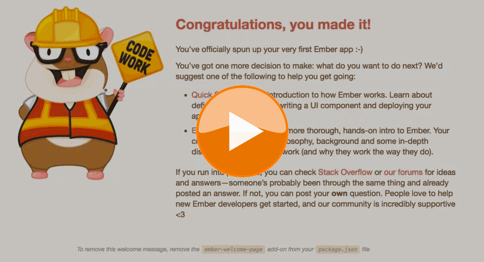

Welcome to **Free Ember Workshop** hosted by [Ember.js Louisville](emberlou).

# Pre-event setup instructions

0. Install **nvm** by pasting the following command into your terminal window: 
	* `curl -o- https://raw.githubusercontent.com/creationix/nvm/v0.31.4/install.sh | bash`
	* Once installed, you need to either close your terminal window and open a new one or source your new changes as shown in the video above.
0. Install **node** with nvm by pasting the following command into your terminal window:
	* `nvm install node`
0. Install **Ember** by pasting the following command into your terminal window: 
	* `npm install -g ember-cli`
0. You're ready to create a new project named **workshop** by pasting the following command into your terminal window: 
	* `ember new workshop`
0. Move into the **workshop** directory, and you're ready to get started!
	* `cd workshop`

# Ember is opinionated; here's why that's important

Web application development can involve a lot of repetition. Attempts to reduce repetition gave rise to a variety of scaffolding tools and best practices. These tools try to reduce the amount of work necessary by providing a set of best practices enabled by default.

Choices that are oftentimes left to developers include:

* Setting up an application's directory structure
* Creating generators for common scenarios
* Determining which build system to use
* Compiling and minifying assets
* Choosing a testing framework

Ember makes many of these decisions for us through conventions. Conventions are great for developers as they leverage framework decisions to be productive and eliminate boilerplate and repetitive code. Developers can (and do) debate whether or not opinionated frameworks are a good thing, but let us share why we love conventions.

0. A developer can join any Ember project and immediately start making meaningful contributions.
0. Projects are organized, so you'll know the application structure and files are where you would expect them to be. 
0. Developers can focus on building what's specific about their app and let Ember handle the aspects that are common to all applications.
0. Substantial improvements are introduced to Ember through an [RFC process][rfc] where ideas are debated and  feedback is gathered.
0. These strong opinions come from an amazing [core team][core] and [community][community].

# Ember CLI

[Ember CLI][ember-cli] is a command line interface (CLI) that helps manage and enforce *conventions* of the Ember framework. We'll dive into these choices in more detail later, but at a high level Ember CLI builds in:

* A broccoli-powered asset pipeline
* A strong project structure
* A powerful addon system for extending Ember
* The QUnit testing framework
* Dependency management
* Runtime configuration options

Every Ember app starts with `ember new project-name`. For a list of possible commands, type `ember` in your terminal window. We'll go through many of these commands in the workshop.

# Modules

Modules allow you to divide logical portions of code into smaller functional pieces and include them as needed. As your application grows, smaller pieces of functional code become easier to manage, support, maintain and test. To learn more about JS Modules, check out [jsmodules.io][jsmodules].

# Naming best practices

Here are a few Ember naming conventions:

0. Code
    0. `TitleCase` naming of classes
    0. `camelCase` naming of attributes
    0. use modules, avoid globals
    0. reusable code → components and addons
0. Files
    0. `kebab-case-naming.js`
    0. children in subdirectory → `routes/invoices/edit.js` & `routes/invoices/new.js`

[bower]: http://bower.io/
[ember-cli]: http://ember-cli.com
[emberlou]: https://www.meetup.com/Ember-js-Louisville/
[npm-g-without-sudo]: https://github.com/sindresorhus/guides/blob/master/npm-global-without-sudo.md
[node-install]: https://nodejs.org/download/
[git-scm]: http://git-scm.com/downloads
[npm-no-sudo-script]: https://github.com/glenpike/npm-g_nosudo
[jsmodules]: http://jsmodules.io
[ember-cli]: http://ember-cli.com
[core]: http://emberjs.com/team/
[community]: http://emberjs.com/community/
[rfc]: https://github.com/emberjs/rfcs